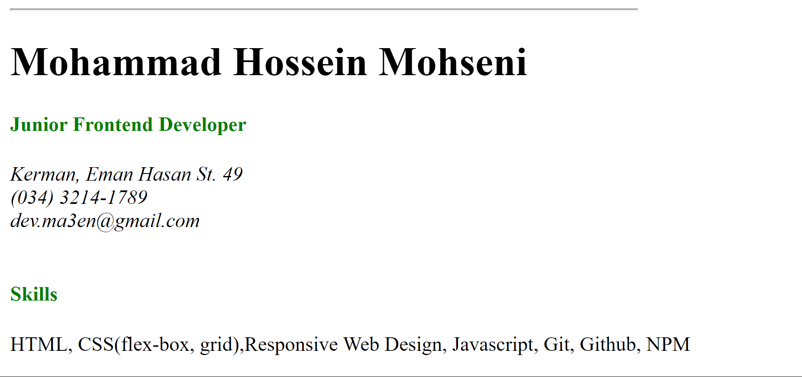

<h1 align="center">Single Page CV 📝<h1>

### A single-page HTML CV to showcase my career history
### No CSS used in this project (except some inline styles for color)
### A Project by [roadmap.sh](https://roadmap.sh)
### In this project I used important topic below: 
- meta tags for SEO 
- OG tags for better sharing on social media
- several favicons
- semantic tags for better structure of html document
### Use live-server on `index.html` to see the result
### See demo on [This URL](https://devmasen.github.io/single-page-cv/)